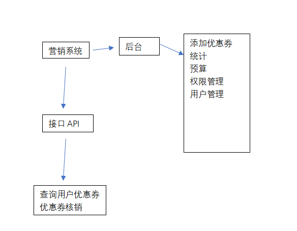
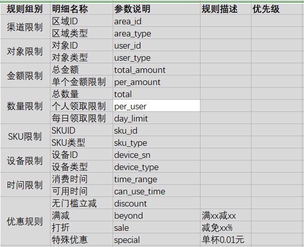
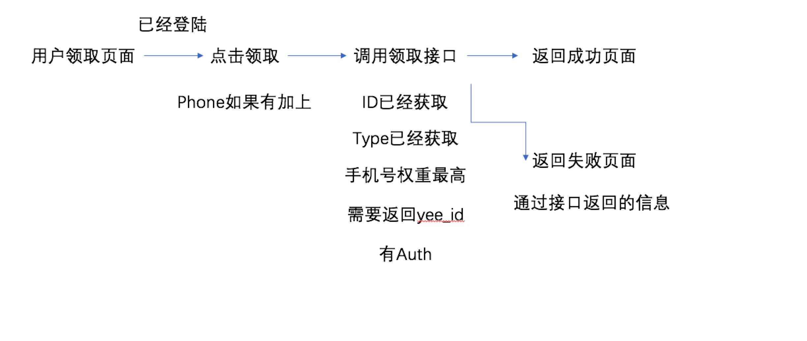

## 知识收集

## 设计思路
- 用户：登录，用户优惠劵中心
- 前台：优惠卷展示
- 后台：【新建规则+规则库】= 发布优惠
- 商家后台：发布优惠价+绑定优惠劵规则

## 概述
1. 表现形式和内在
    
    优惠券/活动券/促销活动 承载促销的外部表现形式，规则通用

2. 优惠券

    私有形式的，可以直接关联到会员账户，在结账时选择使用

    公开形式的，在结账时手动录入优惠券码使用。

3. 设计

    通用的规则定义和规则利益，形成规则库

4. 规则关联

    关联一条规则

    虽然可以关联多条，但是这样 没有实际价值， 关联一条会让业务和现实更加清晰

5. 优惠券

    优惠券分为定义和实体部分

    定义规则：使用规则，优惠规则

6. 促销活动

    和优惠券形式不同，它不需要选择优惠券，也不需要输入优惠券码，只要规则符合 就可以生效。适用于如免费领取赠品，买 A 送 B，全站满 100 减 10 的促销之类。

7. 规则定义

    按 资格类型和配置 –》选择规则利益类型和配置 –》选择基于对象类型和配置（因 为不同的利益类型可以选择的对象类型是不一样的）--》配置规则利益（有些规则 利益有多条，即阶梯优惠）

8. 优惠券使用日志

    无论是可以使用单次还是多次的优惠券，记录日志有利于查询。

9. 规则参与日志

    处理为了查询外，关键的业务是为了判断用户是否参与过这个促销活动，比如有些 免费送活动，每个会员只能参加一次。    

- 描述
    - 营销系统，优惠券分发
- 用户
    - 易咖手机注册的用户
    - 匿名支付购买的用户
- 功能
    - 促销
    - 抵用，活动满减
    - 打折
    - 特殊（特价）
- 特性
    - 
- 风险
    - 领券是一个事务，如果多个规则涉及到数据库更新操作
    - 比如券限制总量也限制单用户领取数量
    - 规则互斥

## 输入

## 工具&技术

## 输出

>参考

- [手把手教你设计促销系统](http://www.sohu.com/a/295564411_120056078)
    - 5W2H的方法拆解
        - 商品信息（What）
        - 促销规则（How,Why）
        - 定向用户（Who）
        - 发放渠道（Where）
        - 活动计划（When）
        - 投入成本（How Much）
    - 促销系统核心功能
         - 促销系统的核心诉求主要是解决将商品按照一定的方式和玩法售卖并告知用户，刺激用户加大消费力度的管理系统
         - 促销活动：活动投放的设置管理，负责提供活动方式和商品内容
         - 促销规则：促销规则的设置管理，负责提供促销玩法
         - 优惠券：负责优惠券管理，提供一种相对独立的促销形式
    - 促销活动的基本属性管理，主要功能包括
        - 商品选择：参加促销的商品，分为活动商品和赠品两种。
        - 促销类型：何种促销方式
        - 规则选择：具体促销规则的参数
        - 投放时间选择
        - 投放区域选择（020必选项）
        - 打标签：商品数据打促销标识，前端显示促销标签
    - 促销规则
        - 促销规则是促销系统核心中的核心，也就是俗称的VIP中P。
        - 一个促销系统的好坏取决于促销规则设计的是否合理，促销规则间接也依赖于其他相关系统的制约。
        - 促销规则有几个维度的划分：平台、商品种数、促销方式
    - 从平台分为：“自营促销”和“POP平台促销”
    - 从促销类型分为：“单品促销”、“集合促销”和“店铺级促销”
        - 单品促销：以单个商品为维度进行的促销叫单品促销，例：限时抢。
        - 集合促销：通过商品集合来满足促销规则进行的促销叫集合促销，例：满额减。
        - 店铺级促销：以商家店铺为维度进行的促销叫店铺级促销，例：店铺级满额折。
    - 从促销方式分为：
        - 直减类：限时抢、直减、多买多折、VIP专享价、手机专享价等
        - 送赠品类：满赠
        - 换购类：加价购，凑单
        - 满额类：满额减、满额折等
        - 返券类：满额返券
        - 组合优惠类：套餐
        - 预订类：团购
    - 考虑购买时活动间的共享与互斥
    - 原则上所有的商品同一时间不可以参加两项活动，按照一定的优先级完成用户的优惠享用（例如单品>组合>品类>整单（或店铺），满减优先级大于代金券，优惠金额多的规则优先等）。
    - 但有两种情况可以例外：
      - 价格类直减和满额累促销可以共享，可以使用优惠后的价格来计算满足金额。
      - 优惠券和部分促销类型可以共享。具体的情况要看业务实际过程中毛利的情况和考虑来决定。
    - 优惠券
        - 优惠券是以劵的方式实行促销优惠。优惠券管理需要设置生效时间，使用次数，发放方式优惠券优惠形式
        - 优惠券的也有几个维度的划分：品类、平台、促销类型
            - 品类：按照类目品类区分
            - 平台：分为自营和店铺、全场
            - 促销类型：满减、直减
    - 结语
        - 促销的本质是刺激用户消费，促销系统的目标是通过各种用户可理解的方式实现提高用户购买意愿的功能。上文仅仅只是简述了促销的冰山一角 
- [产品经理之优惠券设计与管理](https://baijiahao.baidu.com/s?id=1620260014338155702&wfr=spider&for=pc)
    - 优惠券的生命周期
        - 制券、发券、使用（正常的费用核销和过期作废）
            - 1.制券：优惠券的信息
                - 名称、类型、面值、使用条件、使用平台
            - 2.发放优惠券
                - 主动领取
                - 被动领取
            - 3.优惠券核销    
                - （1）从用户优惠券列表中选择出当前订单可用的优惠券，包括通用券和产品券，主要从有效期和商品范围等条件判断。
                - （2）若有多种可用优惠券，但是金额不同，默认选择可抵扣最高的优惠券。
                - （3）若金额相同，先匹配同类优惠券，但是优惠券的额度大于支付额度弹出提醒框，确认是否使用。
            - 4.优惠券统计
                -  发送张数、使用张数。
                -  客单价、复购率等。   
        - 优惠券的前端展示
            - 用户优惠券列表、
            - 订单提交页、
            - 购物车、
            - 商品详情页、
            - 领券中心
            - 前端展示的难点在于商品详情页和购物车中展示可用优惠券，需要高效率的算法来计算匹配商品对应的优惠券。
        - 优惠券在订单中的处理
            - 在订单完成售后时，优惠券有一定的返还机制。
            - （1）统一设置不可返还，用了之后就不退。
            - （2）订单中全部退款时，优惠券全部退还。
            - （3）订单中部分退款时，普通优惠券不返还。
        - 优惠券有一套很成熟的产品设计方案，但是目前绝大部分产品难以解决的问题，
        - 思考：基于日常优惠券的使用情况，运营人员如何平衡发放优惠券所带来的成本增长。
            - 商品销量增长和单品毛利下降之间的矛盾？
            - 在申请促销活动经费时，怎样的数据更具说服力？
            - 大家可以一同参与解决

- [促销管理——优惠券设计与架构](https://blog.csdn.net/qqtingshuo/article/details/82964747)
    - 计数据库表 
        - 优惠券基础信息表
        - 优惠券领取记录表 
        - 商品分类表
    - 相关核心代码如下：
        - 前后分离写法，只需提供好接口
        - 优惠卷基础配置信息，针对优惠卷 添加/查询 等  
- [优惠券系统应该如何设计？](http://www.woshipm.com/pd/1056437.html)
    -  优惠券是一套规则的组合，它的基本信息包括
        - 优惠券名称、
        - 发放数量、
        - 优惠券是否可叠加、
        - 每人限领张数、
        - 是否和其他促销同时使用（优惠优先级）、使用规则等。 
    -         
- [优惠券设计：优惠券的发放与使用](https://blog.csdn.net/varyall/article/details/81485471)    
    - 一、系统发放
        - 主动触发形式有通过短信告知用户有优惠券送达（短信中可附上优惠的商品链接，有助于转化。）；或者使用push的方式去提醒用户。
        - 被动响应就是只有用户在使用APP时，系统接受信号后，才能给用户发券。
    - 二、用户领取
        - 直领：优惠券通常会在活动页面显示，用户直接领取即可。
        - 任务领取：用户需要达成一定条件才能获得优惠券，如签到任务、评价返券、分享领取等。
- [谈谈优惠券系统的设计](https://blog.csdn.net/egworkspace/article/details/80414953)  
    - 一、怎么生成优惠券
        - 优惠券模板(生成优惠券)
    - 二、优惠规则的设计   
        - 1、计算型规则。
        - 2、限制型规则
    - 三、优惠规则编号的设计
        - 1、第一位是符号位
        - 2、高8位是规则组别编号
        - 3、第10位和11位作为备用
        - 4、中间15位，存放规则组下的细则编号
        - 5、末6位存放规则组的优先级
        - 6、按照上述规则，根据既定的组别和优先级可以生成上表中的细则编号。 
    - 四、优惠券系统程序设计
        - 1、管理。
        - 2、派发/领取
        - 3、使用
    - 五、总结
        - 业务设计
        - 程序设计       
- [优惠券发放策略设计需求文档](http://www.woshipm.com/pd/1269552.html)   
    - 用户-场景-需求-产品需求
    - 功能优先级排序
    - 流程梳理及模块关系  