# 优惠券发放策略设计需求文档
http://www.woshipm.com/pd/1269552.html

## 一、目的
背景：公司推广需求，现在需要设计一个针对新老用户发送优惠券的系统，用于微信里用户自发的分享传播。

### 要求：
- 以H5为载体，主要用于微信聊天窗和朋友圈的分享「此处为两种分享模式」；
- 注意分享的流程以及流程里必备的判断；
- 注意后台逻辑和前端逻辑的配合，不要忽略后端；
- 重要的页面需要完整原型，其他页面需要简单的页面流程，需要有整体的串联。

### 工作：
- 明确需求背景；
- 需求分析：通过简单的产品功能调研，提供决策过程和依据；
- 需求目的：明确需求目的和功能列表；
- 梳理流程所处的模块关系：业务逻辑、业务流程、页面流程；
- 功能详细介绍：原型设计；
- 考核指标和计算方法。
- 学习目的：锻炼撰写需求文档的能力；锻炼从0到1设计某事件的能力。

## 二、需求背景
- 平台发布了优惠券策略，且取得了较好成果，导致用户的优惠的需求变成产品选择的重要参考因素。
- 用户增长点达到瓶颈，需要拉进新鲜血液，选中微信好友或微信群为突破点实现社群传播，扩大推广渠道与力度。
- 为老客户发放福利，提高其认可度，忠诚度，促进再次消费。
- 用户与用户之间粘性不够，同样通过微信的社交能力带动我方产品的用户互动。

## 三、需求分析与目的
竞品功能点调研
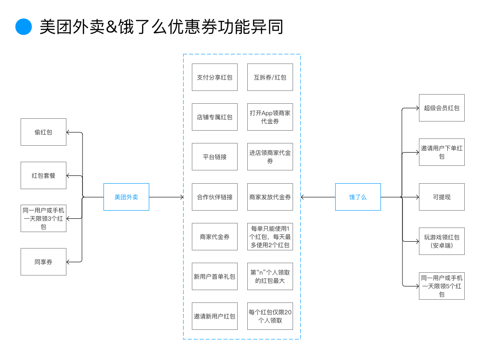

获取方式：

### 相同点

美团外卖和饿了么有4种共同的获取方式：

- 一是进入App时随机发放商家代金优惠券；
- 二是进店领取商家代金优惠券；
- 三是下单支付后获得可分享的红包优惠券；
- 四是邀请新用户后获得的邀请红包。

### 不同点

美团外卖特有的获取方式为偷红包与购买红包套餐，偷红包增加了用户之间的互动与趣味性，更能获取用户相关社交圈的数据；红包套餐以优惠增加用户粘性，用户首先会被其大幅度的优惠以及可用性、易用性（无门槛红包）所吸引购买，然后抱着自己买的红包，怎么也要用完，不然就亏大了的心理进行多次消费，以保障用户活力。

饿了么则推出了超级会员红包模式以留存，且其会员特权如专享红包、奖励金、专属客服、专属折扣、金币特权等可提高用户忠诚度。且多出了一种邀请老用户下单，自己获得红包的模式来促进转化。并且更有玩游戏领红包的趣味获取方式，可以看出饿了么的合作方式的多样性。

红包效能：

- 共同点：都有把优惠券区分为红包、商家代金券、互拆券等形式，都会在分享的优惠券上放上平台链接以及商家或合作伙伴链接，分享的优惠券都可多人领取且按顺序发放最大额度红包，并能多次分享。都有每单只能使用1个红包，每天最多使用2个红包，每个红包仅限20个人领取的限制。
- 不同点：美团推出了同享券（指可与其他优惠活动一起使用的优惠券），而饿了么则推出了红包提现功能，加大了红包的吸引力，与会员功能相互结合体现了饿了么对于新钱包支付模式的尝试。

核心在于H5是否能能否传播开来引导新老用户参与，以及优惠券是否能够打动新用户注册，老用户再次消费。

### 用户-场景-需求-产品需求
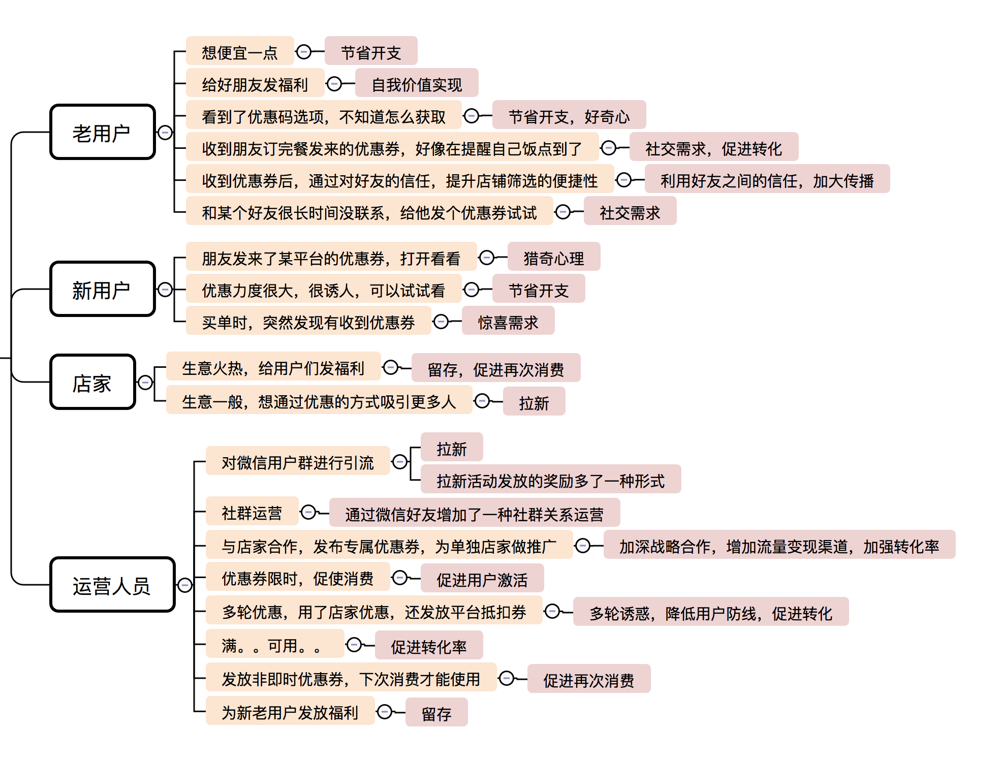

产品需求小结：
```
优惠券基础，优惠券发放基础，优惠券可多次发放、多人领取；
按领取顺序中的某位发放最大奖励；
付款自动生产优惠券；
活动发放优惠券；
规则诠释；
平台链接；
店铺链接；
根据习惯智能推荐商家优惠；
店铺专属优惠券；
专属优惠券附带专属评论；
每次付款生产独立优惠券；
下单时满足条件自动选择优惠券；
手动添加优惠券；
广告投放；
优惠券分类；
有条件优惠券（时间）；
有条件优惠券（金额）；
有条件优惠券（及时性限制）。
```
功能优先级排序

四象限看用户量与发生频率：
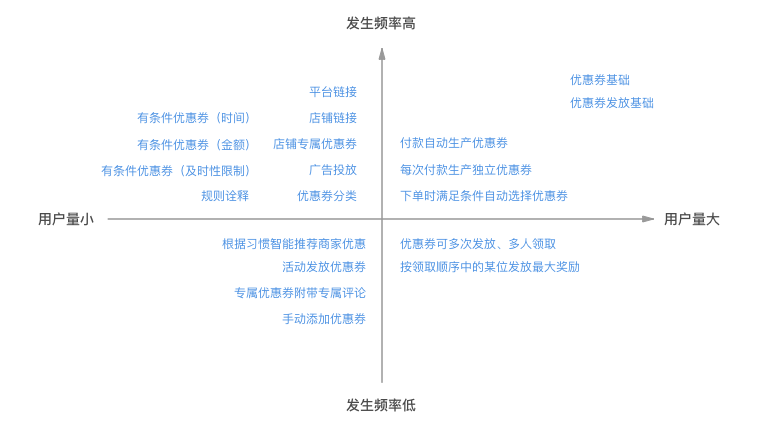

看开发难度和效果：
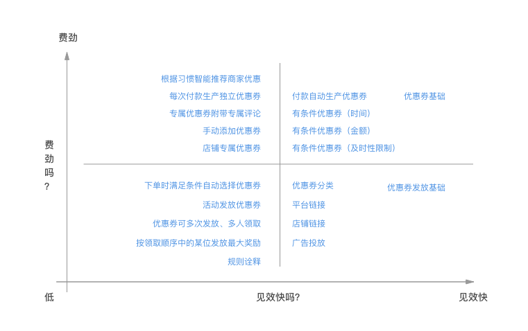

看迫切程度：
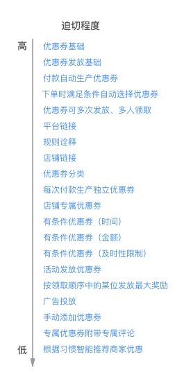

功能优先级排序结论：
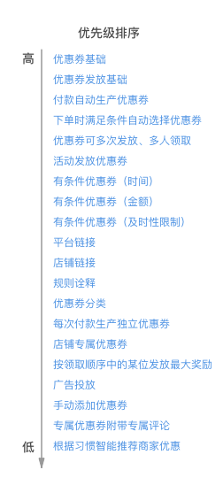

相关页面

平台首页、微信首页、店铺详情页、下单页、支付完成页、优惠券生成页、优惠券分享页、优惠券详情H5页面、优惠券管理页、登陆页等。

前端：
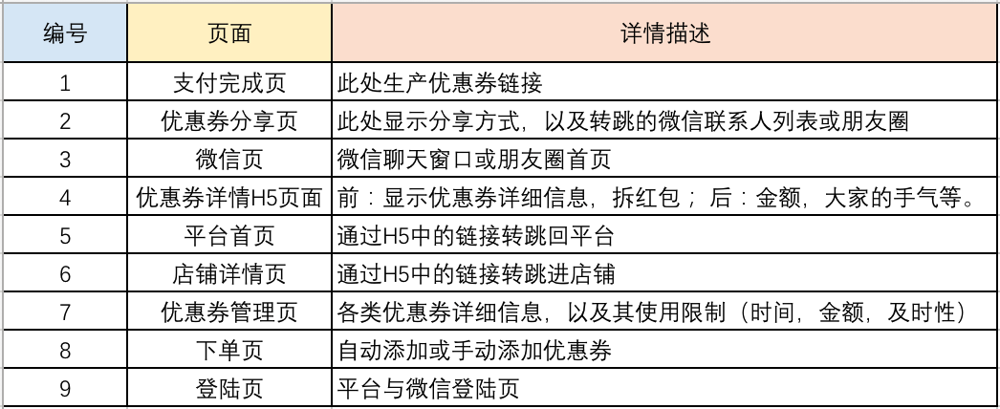

后端：
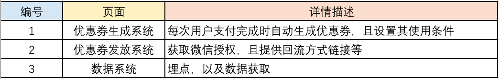


## 四、流程梳理及模块关系
业务逻辑：
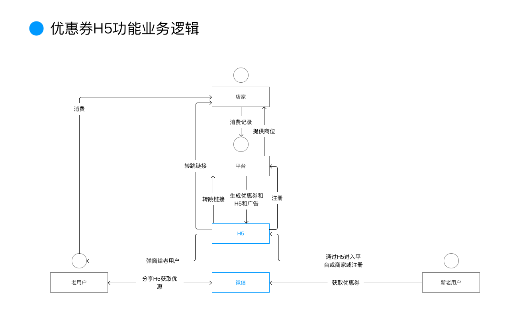

业务流程：
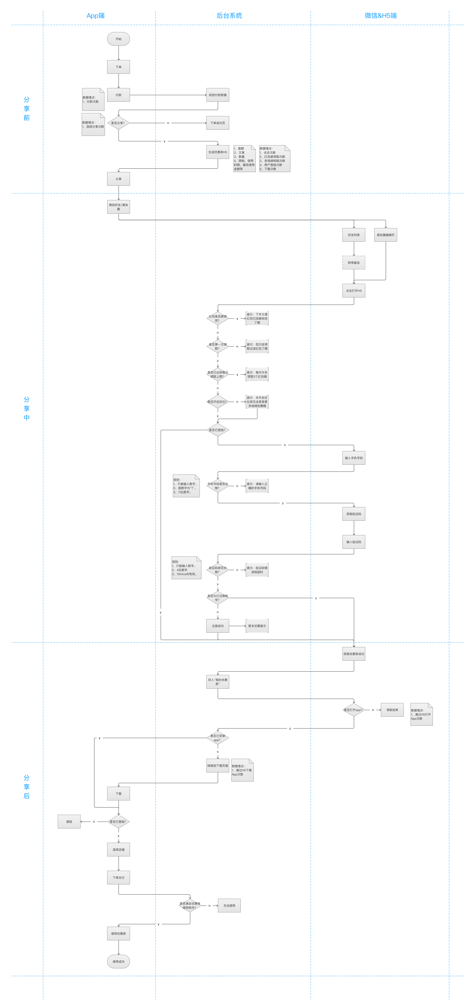


页面流程：
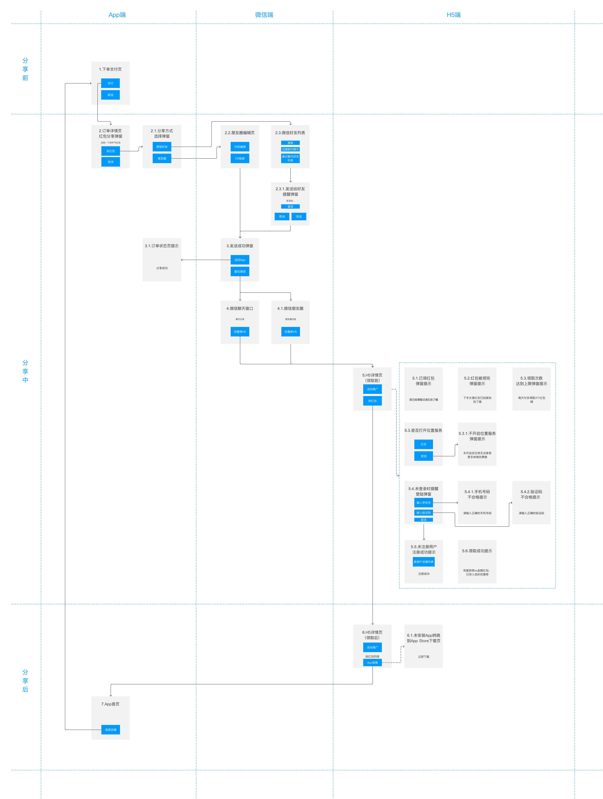


## 五、功能详细介绍
原型设计：


## 六、考核指标和计算方式
- 分享率：分享优惠券数量 / 支付成功数量 * 100%
- 分享成功率：优惠券被打开数量 / 优惠券分享数量 * 100%
- 领取成功率：优惠券被领取数量 / 优惠券分享数量 * 100%
- 新用户注册率：通过优惠券H5手机验证成功自动注册的新用户 / 分享优惠券数量 * 100%
- 回流率：通过优惠券H5链接进入App数量 / 分享优惠券数量 * 100%
- 下载率：通过优惠券H5链接进入转跳页面下载App数量 / 分享优惠券数量 * 100%
- 优惠券使用率：优惠券被领取数量 / 支付时使用优惠券数量 * 100%
- 激活率：发放优惠券功能前用户活跃度 / 发放优惠券功能后用户活跃度 * 100%
- 转化率：发放优惠券功能前用户订单成交数量 / 发放优惠券功能后订单成交数量* 100%
 
