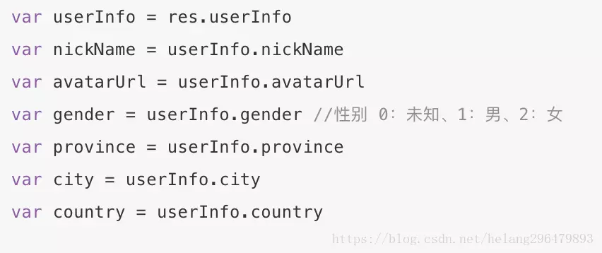
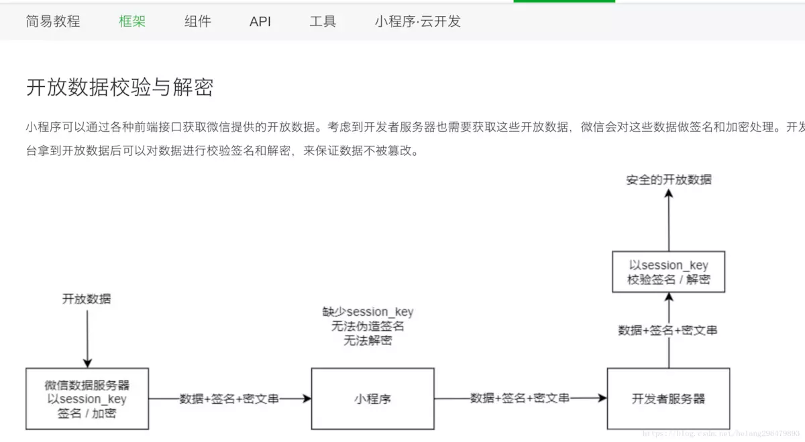
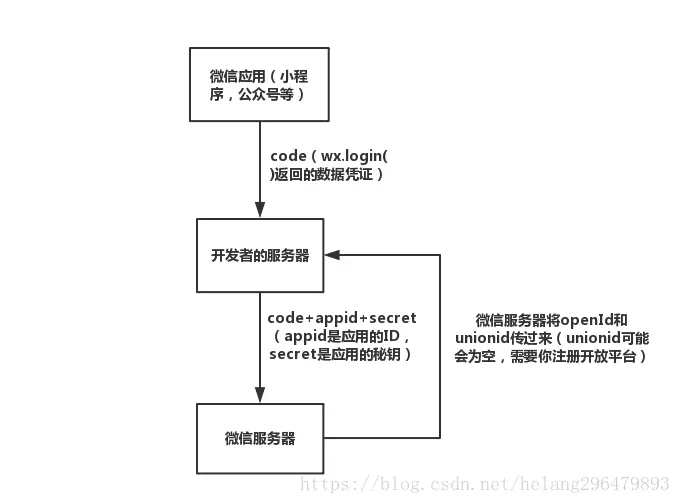

# 微信小程序中的用户ID(openid和unionid)

https://www.jianshu.com/p/865f0679ba52

前沿

做过微信开发的同学，多多少少都会涉及到用户的唯一标示的问题。由于微信牢牢把控着用户的信息，因此当你需要在微信平台中获取用户的标示信息，必然要通过微信的平台接口来获取（当然，你可以通过你自己的平台的逻辑来做，比如让用户注册登录你的平台，但是，这样做，只会让流程更加繁琐，牺牲了用户的体验过程，会得不偿失的）

微信小程序中的ID

在微信小程序的文档中有wx.getUserInfo(Object object)这个接口，但是UserInfo并不包含用户唯一的标示信息，具体可以看下面的截图

当然，肯定会有办法的。看看wx.login(Object object)这个接口，它返回了一个code值，表示用户登录凭证（有效期五分钟），光有code还是不行，继续在文档中找，发现这个code是和appid,secret，一起访问微信的接口，然后可以得到openId和unionid，下面就对openId和unionid做个简单说明

openId

是表示用户在你的当前应用中的唯一标示,比如小程序，微信公众号等，这些都算是一个应用，如果你有多个应用，同一个用户的openId可能并不相同

unionid

借用微信官方文档中的话来说，如果开发者拥有多个移动应用、网站应用、和公众帐号（包括小程序），可通过 UnionID 来区分用户的唯一性，因为只要是同一个微信开放平台帐号下的移动应用、网站应用和公众帐号（包括小程序），用户的 UnionID 是唯一的。换句话说，同一用户，对同一个微信开放平台下的不同应用，unionid是相同的

获取openId和unionid

看了一下微信的官方文档，写得较为复杂，需要花点时间看

我这里简化一下

过程并不复杂，其实这里需要说一下的是，为什么会多了一步，开发者服务器去访问微信接口呢？其实，微信官方文档说得很清楚，如果appid和secret存在应用本地，应用本身是容易被破解和抓包，非常容易泄露的，会导致安全问题；因此，放到开发者的服务器去访问，能够保证一定的安全性，除非服务器被攻破，否则很难知道appid和secret的

总结

同一个用户，在你的多个应用中，openid可能都不相同；但是，unionid一定会相同的。所以，如果你有多个小程序或者微信公众号，需要确定是否为同一个用户的时候，就需要unionid来确定。理解微信的ID并不难，因为文档中有些地方说得较为复杂，获取用户的openid和unionid需要花点时间去阅读
 
>其他

- [微信公众号开发之网页授权（获取用户信息）](https://www.cnblogs.com/jinxiaohang/p/7193505.html)
